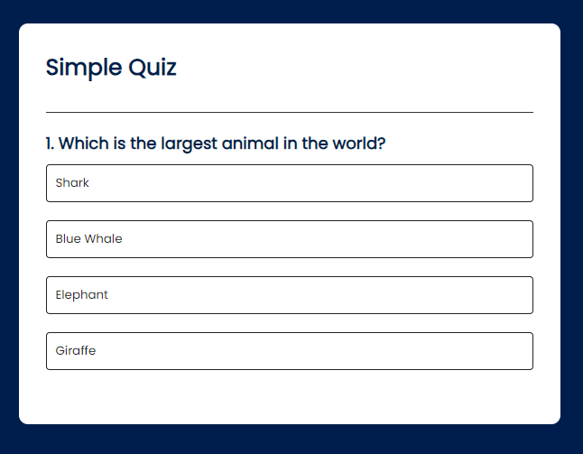
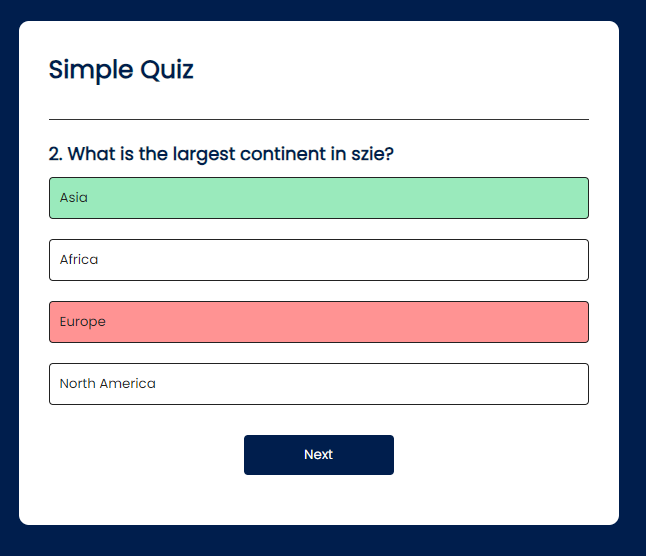
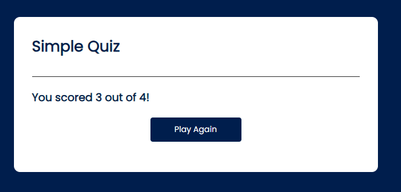

# Simple Quiz App README

Welcome to the Simple Quiz App repository! This web application is a basic quiz game created using HTML, CSS, and JavaScript. It allows users to test their knowledge on a variety of topics through an interactive and fun quiz experience.

## Table of Contents
- [Introduction](#introduction)
- [Features](#features)
- [Installation](#installation)
- [Usage](#usage)
- [Technologies Used](#technologies-used)
- [Screenshots](#screenshots)
- [Contributing](#contributing)
- [License](#license)

## Introduction
The Simple Quiz App is a project developed by Thembi as part of my journey in upskilling in web development. It's designed to provide an engaging way for users to take quizzes and learn about different subjects.

## Features
- **Multiple Choice:** Each question presents multiple-choice options for users to select.
- **Score Tracking:** The app keeps track of the user's score.
- **Feedback:** Immediate feedback is provided after each question.

## Installation
To run the Simple Quiz App locally, follow these steps:

1. Clone this repository:
   ```
   git clone https://github.com/ngww/quiz-app.git
   ```

2. Navigate to the project directory:
   ```
   cd quiz-app
   ```

3. Open the `index.html` file in your preferred web browser.

## Usage
1. Open the app in your browser.
2. Select a quiz category or topic.
3. Answer the questions by choosing one of the provided options.
4. Click the "Next" button to proceed to the next question.
5. After completing the quiz, view your score and feedback.

## Technologies Used
- HTML5
- CSS3
- JavaScript

## Screenshots
[Live Demo](https://quiz-app-ngww.vercel.app)





## Contributing
Contributions to the Simple Quiz App are welcome! If you have ideas for new features or improvements, please feel free to create a pull request. Ensure that your contributions align with the project's goals.

## License
This project is licensed under the [MIT License](LICENSE).

---

Thank you for checking out the Simple Quiz App! It's a great way to engage users in learning and testing their knowledge. If you have any questions or suggestions, feel free to contact me via twitter at @ngwcodes. Enjoy the quiz experience!